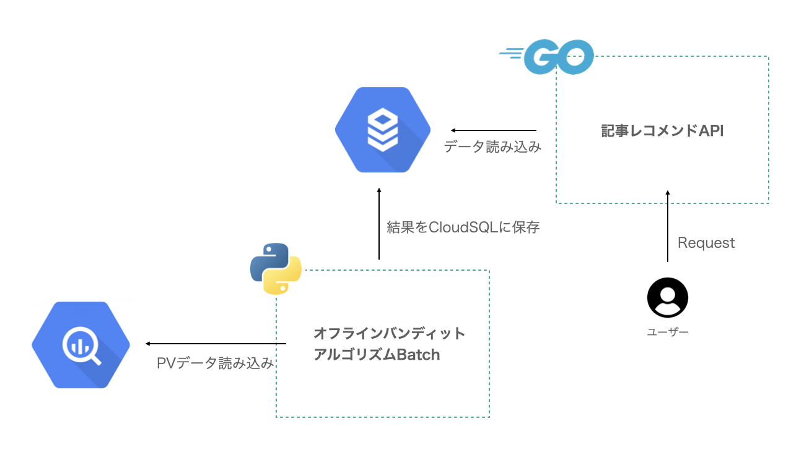

# バッチ化バンディットアルゴリズムのグリッド理論とBABAアルゴリズムの実装

本稿ではバッチ化バンディットアルゴリズムの問題の紹介を行い、それを解決するためのグリッドと呼ばれる概念を導入し、実際にBaSEポリシーと呼ばれるバッチ化バンディットアルゴリズムのためのポリシーを実装して結果を見ていきます。

## イントロダクション

バンディットアルゴリズムは迅速かつ簡単に実装でき、トレーニングデータを必要とせず、継続的なテスト/学習が可能であるため、アプリケーションのレコメンドなどで適用される人気の高い手法です。

エムスリーのAI・機械学習チームでもバンディットアルゴリズムを使って記事推薦システムが動いています。探索対象の記事のPVデータを取得し、オフラインでバンディットアルゴリズムを実行し、結果をCloudSQLに保存して、ユーザーに提供しています。

このアーキテクチャではバンディットアルゴリズムは即時の報酬を受け取ることができません。その代わり、ユーザーからの報酬をバッチ化してまとめてバンディットアルゴリズムを実行します。これをバッチ化バンディットアルゴリズムといいます。

バッチ化バンディットアルゴリズムは報酬を即時に反映する必要がないので、実装コストを抑えてレコメンドを実装することが可能です。これだけでもエムスリーでは大きな利益を生んでいます。

しかし、このようなバッチ化バンディットアルゴリズムは、最適なバッチの構造やサイズ、数について議論されることなく実装されがちです。

そこで今回はバッチ化バンディットアルゴリズムの問題やそれを解決するためのグリッドと呼ばれる概念を導入し、実際にBaSEポリシーと呼ばれるバッチ化バンディットアルゴリズムのためのポリシーを実装して結果を見ていきます。

## バンディットアルゴリズムの復習

### UCBポリシーによるオフラインレコメンド

エムスリーで利用されている実装を紹介します。

## バッチ化バンディットアルゴリズム

## バッチ化UCBポリシーバンディットアルゴリズム

## バッチ化BaSEポリシーバンディットアルゴリズム

## まとめ